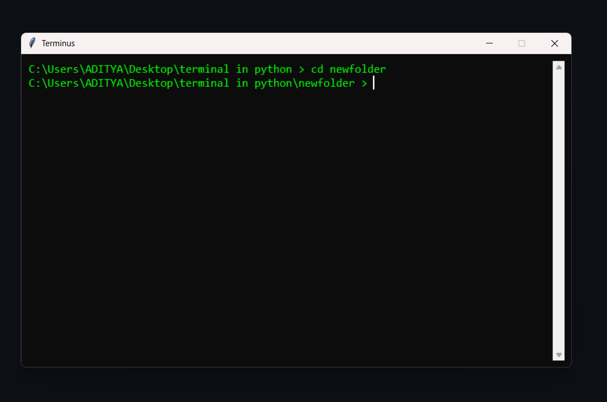

# 🧠 Terminus – Custom Python GUI Terminal

A modern, customizable **Python terminal emulator** built using **Tkinter**.  
Supports real-time command execution, color theme switching, and a smooth interactive experience.  
Inspired by the look and feel of professional developer terminals.

---

## 🖼️ Screenshot


> *A clean and colorful terminal interface with dynamic color themes.*

---

## 🚀 Features

✅ **Command Execution:**  
Runs system commands directly using Python’s `subprocess` module.

✅ **Custom Prompt:**  
Shows the current working directory (like `C:\Users\YourName >`) and updates automatically after `cd`.

✅ **Cross-Platform Support:**  
Works on both **Windows** and **Linux** (uses `subprocess` and `os`).

✅ **Multi-threaded Output:**  
Runs commands without freezing the UI using Python’s `threading`.

✅ **Modern Look:**  
Dark UI with colorful buttons and smooth fonts (`Consolas`, `Monospace`).

---

## 🛠️ Tech Stack

| Component | Technology |
|------------|-------------|
| GUI | Tkinter |
| Backend | Python `subprocess`, `threading`, `os` |
| Image Handling | Pillow (`PIL`) |
| Platform | Cross-platform (Windows/Linux) |

---

## ⚙️ Installation

### 1. Clone the repository
```bash
git clone https://github.com/Aditya04012/Terminus.git
cd Terminus
```

### 2. Install dependencies
```bash
pip install pillow
```

### 3. Run the terminal
```bash
python main.py
```

---


## 💡 How It Works

- **Frontend:** Tkinter builds the GUI, color buttons, and terminal layout.  
- **Backend:** Subprocess executes shell commands and streams the output in real time.  
- **Threading:** Output reading is handled in a separate thread to keep the UI responsive.  
- **Themes:** Clicking any color button dynamically changes terminal background and text color.

---

## 🌱 Future Improvements

- Add **syntax highlighting** for Python and shell commands.  
- Include **command history** and **auto-suggestions**.  
- Add **config.json** for custom user themes.  
- Support for **tabs** and **split panes**.  

---

## 🧑‍💻 Author
**Aditya Bhatnagar**  
Built using Python 🐍 + Tkinter 💻  
Inspired by Linux terminals & VS Code aesthetics.

---

